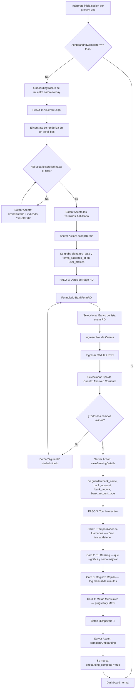
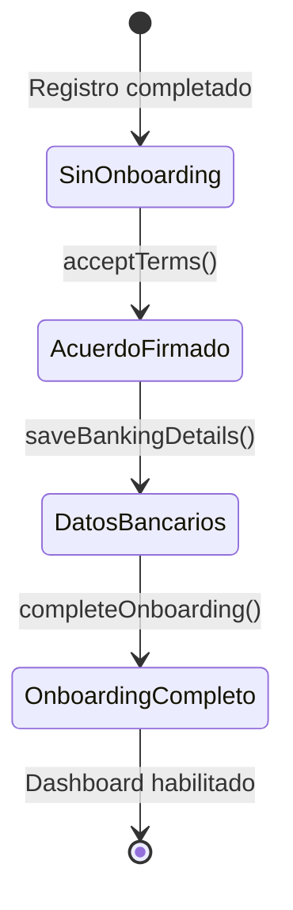

# SOP 03 — Flujo de Onboarding del Intérprete

> **Versión:** 2.0
> **Última actualización:** 2026-05-01
> **Responsable:** Lead Architect
> **Aplica a:** Todo nuevo intérprete con `isFirstLogin === true`

---

## 1. Objetivo

Garantizar que cada nuevo intérprete complete un proceso de incorporación estructurado
que incluya la aceptación legal, la configuración de pagos y un tour funcional antes de
acceder al dashboard de producción.

---

## 2. Diagrama de Flujo

---

## 3. Detalle por Paso

### 3.1 Paso 1 — Acuerdo Legal (Contrato de Confidencialidad)

**Archivo fuente:** `src/components/OnboardingWizard.tsx`

| Aspecto | Detalle |
|---|---|
| **Contenido** | Contrato de Prestación de Servicios (Freelance) con cláusulas de confidencialidad HIPAA |
| **Mecanismo de lectura forzada** | Scroll listener detecta cuando el usuario llega a ≤40px del final del contenedor |
| **Acción bloqueante** | El botón "Acepto los Términos" permanece `disabled` hasta que `hasScrolledToBottom === true` |
| **Persistencia** | `acceptTerms()` actualiza `terms_accepted_at` y `signature_date` en `user_profiles` vía Supabase Client |
| **Referencia documental** | `documentation/01_Administrative/01_Acuerdo_Confidencialidad.md` |

### 3.2 Paso 2 — Datos de Pago (Exclusivo Transferencia Bancaria RD)

**Archivo fuente:** `src/components/BankFormRD.tsx` (integrado en `OnboardingWizard`)

| Campo | Tipo | Validación | Ejemplo |
|---|---|---|---|
| Banco | `select` (enum) | Requerido, debe ser un banco RD válido | `Banreservas` |
| No. de Cuenta | `text` | Requerido, mín. 5 caracteres, solo numérico | `0123456789` |
| Cédula / RNC | `text` | Requerido, formato `XXX-XXXXXXX-X` | `001-1234567-8` |
| Tipo de Cuenta | `select` | Requerido: `Ahorro` o `Corriente` | `Ahorro` |

**Validaciones en cliente:**

- Todos los campos son obligatorios.
- El número de cuenta acepta solo dígitos.
- La cédula se valida con el formato dominicano (`/^\d{3}-\d{7}-\d{1}$/`).

**Validaciones en servidor:**

- `saveBankingDetails()` verifica que los 3 campos principales no estén vacíos.
- Sanitiza los valores con `.trim()` antes de guardarlos.

### 3.3 Paso 3 — Tour Interactivo

**Archivo fuente:** `src/components/OnboardingWizard.tsx` (sección tutorial)

El tour consiste en **4 tarjetas interactivas** que se expanden al hacer clic:

| # | Título | Descripción |
|---|---|---|
| 1 | ⏱️ Temporizador de Llamadas | Explica cómo usar el botón "Iniciar Llamada" y que el tiempo se registra incluso al cambiar de pestaña (Web Worker) |
| 2 | 📊 Tu Ranking | Describe el sistema de posiciones basado en minutos interpretados y su impacto en oportunidades |
| 3 | 💰 Registro Rápido | Indica cómo registrar minutos manualmente si se olvidó iniciar el temporizador |
| 4 | 🎯 Metas Mensuales | Explica que la meta se personaliza según el perfil y cómo alcanzar el 100% |

**Comportamiento:** El usuario debe hacer clic en al menos una tarjeta antes de que
el botón "¡Empezar!" se habilite (UX guidance, no bloqueo técnico).

---

## 4. Componentes Involucrados

| Componente | Archivo | Rol |
|---|---|---|
| `OnboardingGate` | `src/components/OnboardingGate.tsx` | Client-side gate que decide si mostrar el wizard |
| `OnboardingWizard` | `src/components/OnboardingWizard.tsx` | Wizard de 3 pasos con stepper visual |
| `BankFormRD` | `src/components/BankFormRD.tsx` | Formulario aislado de datos bancarios RD |
| `acceptTerms` | `src/app/actions/onboarding.ts` | Server Action — guarda fecha de firma |
| `saveBankingDetails` | `src/app/actions/onboarding.ts` | Server Action — guarda datos bancarios |
| `completeOnboarding` | `src/app/actions/onboarding.ts` | Server Action — marca onboarding completo |

---

## 5. Diagrama de Estados del Perfil

---

## 6. Criterios de Aceptación

- [ ] El wizard se muestra **solo** cuando `onboarding_complete === false`.
- [ ] El botón "Acepto" se habilita **solo** cuando el scroll llega al final.
- [ ] Los datos bancarios son **obligatorios** — no se puede saltar al paso 3 sin completarlos.
- [ ] Al completar el onboarding, el wizard se oculta **inmediatamente** sin recargar la página.
- [ ] Los datos persisten en la base de datos — un refresh no reinicia el proceso.
